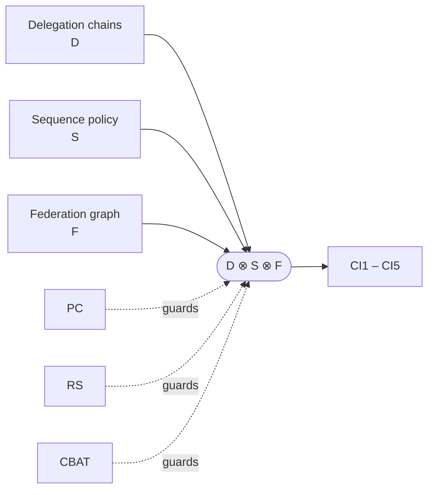

# SynectivSec

**A composition theorem for federated agent authority.**

[](https://github.com/kakashi-kx/synectivsec/actions)

[-0969da?labelColor=24292f&style=flat)](paper/)


[](https://orcid.org/0009-0009-9232-7820)

Delegation chains, sequence policies, and cross-domain federation each have formal
treatments. None states when their composition preserves the safety properties of its
parts. This repository gives three compatibility conditions, a preservation theorem,
a bounded-instance TLA+ check, and a runnable harness showing each condition is
independent of the other two.

[Paper](paper/) · [Spec](docs/) · [Claims ledger](#claims-ledger) · [Reproduce](#reproduce) · [How to break this](#how-to-break-this)

> [!IMPORTANT]
> The theorem is model-checked on one bounded instance. It is not proved in general.
> The exact scope is stated under [Verification](#verification) and in
> [`LIMITATIONS.md`](LIMITATIONS.md).

---

## Result



> **Theorem (Composition Preservation).** If $\mathrm{PC} \land \mathrm{RS} \land \mathrm{CBAT}$
> hold for $D \otimes S \otimes F$, then $\mathrm{CI1}$ through $\mathrm{CI5}$ hold.

| Condition | Statement | Restates | Added here |
|---|---|---|---|
| PC | every action producible under a chain in `D` is classified by `S` | Bounded Agents (arXiv:2608.15888) | joint use with RS and CBAT |
| RS | revocation reaches every attested domain within δ | SPKI/SDSI validity intervals (RFC 2693 §5.4) | applied over a domain graph, jointly |
| CBAT | attestation composes across domains unless explicitly bounded | speaks-for transitivity (Lampson, Abadi, Burrows, Wobber, TOCS 10(4), 1992, §3.2); bounded variant (§3.3, note on P10); linked roles (Li, Mitchell, Winsborough, RT, 2002) | joint use with PC and RS |

The claimed contribution is the composition operator, the joint formulation of the
three conditions, and the preservation theorem. No condition is claimed as new in
isolation. Full treatment of related work is in [`docs/POSITIONING.md`](docs/POSITIONING.md).

| Invariant | Meaning |
|---|---|
| CI1 | Authority containment |
| CI2 | Sequence soundness |
| CI3 | Revocation freshness |
| CI4 | Attestation soundness |
| CI5 | Boundary determinism |

---

## Claims ledger

Each claim carries one of three labels. The labels are used the same way in the paper.

| Claim | Status | Evidence |
|---|---|---|
| Composition operator and model are well defined | Defined | [`docs/ALGEBRA.md`](docs/ALGEBRA.md) |
| PC, RS, CBAT imply CI1–CI5 in the abstract model | Proof (see paper) | [`paper/`](paper/) |
| No violation of CI1–CI5 on the checked instance | Verified (bounded) | [`tla/RESULT.md`](tla/RESULT.md) |
| Each condition is independent of the other two | Verified (counterexample) | [`redteam/`](redteam/) |
| The theorem holds for arbitrary instance sizes | Open | not claimed |
| Behavior of real agent deployments matches the model | Open | not claimed |

---

## Verification

```
Model checking completed. No error has been found.
11,185,890 states generated, 300,447 distinct states found, 0 violations.
```

Instance: 6 principals, 2 delegation chains, 3 trust domains, capability attenuation,
global sequence policy, bounded history (time ≤ 4). Runtime is about 33 seconds. The
authoritative configuration and full output are in [`tla/`](tla/); CI reruns the check
on every push.

> [!NOTE]
> A bounded model check shows that no violation exists within the checked instance.
> It does not show the theorem for larger instances. Scaling is limited by TLA+
> state-space growth, and a mechanized general proof is future work.

---

## Independence of the conditions

Dropping any one condition while keeping the other two admits a reachable state that
violates a named invariant. Each attack is a runnable script backed by a TLC
counterexample trace.

| Attack | Condition dropped | Invariant violated |
|---|---|---|
| Alphabet escape | PC | see `redteam/` |
| Revocation race across domains | RS | see `redteam/` |
| Attestation laundering | CBAT | see `redteam/` |

This shows the conditions are non-redundant in the constructions given. It does not
show that no fourth condition is needed.

---

## How to break this

The most useful contribution is a counterexample. If you can construct a composition
where PC, RS, and CBAT all hold and a CI1–CI5 invariant is violated, the theorem as
stated is false. Open an issue with a minimal reproduction, ideally as a TLA+ trace or
a script under `redteam/`. Disagreement with the model's assumptions is also in scope;
state which assumption and why.

---

## Reproduce

Requires Java 17 or later and `tla2tools.jar`.

```
cd tla
java -XX:+UseParallelGC -jar tla2tools.jar -config Composition.cfg Composition.tla
```

The attack harness needs Python 3:

```
cd redteam
python3 <script>.py
```

---

## Reading guide

| If you are | Start with |
|---|---|
| Reviewing the theorem | `paper/` (proof), then `docs/ALGEBRA.md` |
| Checking the mechanization | `tla/Composition.tla`, `tla/Composition.cfg`, `tla/RESULT.md` |
| Trying to falsify it | `redteam/`, then [How to break this](#how-to-break-this) |
| Assessing prior art | `docs/POSITIONING.md` |
| Applying the ideas to agent systems | `docs/POLICY.md`, `docs/FEDERATION.md`, `docs/AUDIT.md` |

---

## Repository layout

```
tla/            TLA+ model, TLC configuration, verification results
redteam/        Attack harness: one script per compatibility condition
docs/           ALGEBRA, POLICY, FEDERATION, AUDIT, POSITIONING
paper/          Paper (PDF and LaTeX source)
LIMITATIONS.md  What is not done and what is not claimed
CONTRIBUTING.md How to contribute
CITATION.cff    Citation metadata
```

There is no reference implementation. This is a research artifact, not a product.

---

## Limitations

- Verification is bounded (one instance, time ≤ 4). The general theorem is not mechanized.
- The joint formulation of RS with the other two conditions still needs a systematic
  prior-art search.
- The relationship between CBAT and RT's linked roles is cited but not yet fully
  reconciled.
- The model abstracts real agent deployments. No claim is made about specific systems.

See [`LIMITATIONS.md`](LIMITATIONS.md) for the maintained list.

---

## Author

**Abhijith S** [kakashi4kx] — security researcher. Formal methods applied to agent
authorization; red team background.

- **Interests:** agent authorization, trust composition, offensive-security research
- **This repo:** a composition theorem for federated agent authority, with TLA+ verification and an independence harness

[ORCID](https://orcid.org/0009-0009-9232-7820) · [GitHub](https://github.com/kakashi-kx) · [LinkedIn](https://linkedin.com/in/abhixjith)

## Citation and license

Citation metadata is in [`CITATION.cff`](CITATION.cff). Specification and paper under
CC-BY 4.0, code under Apache-2.0.
